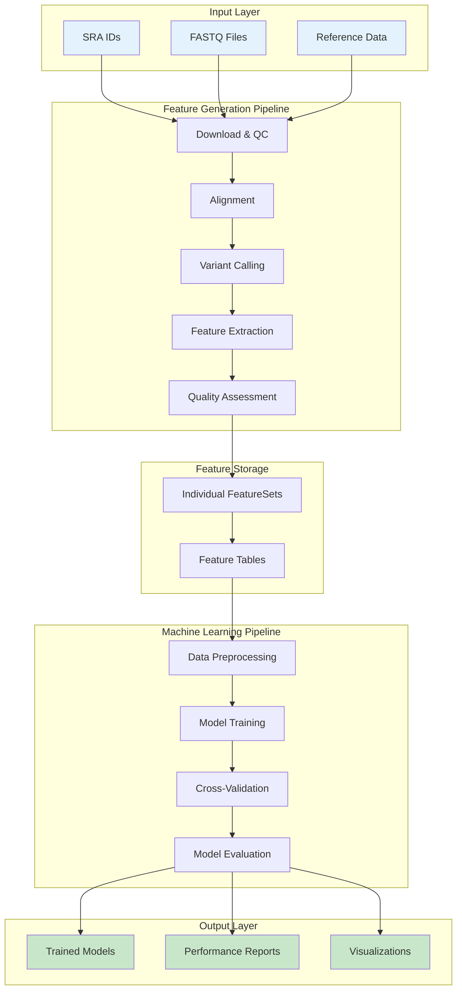
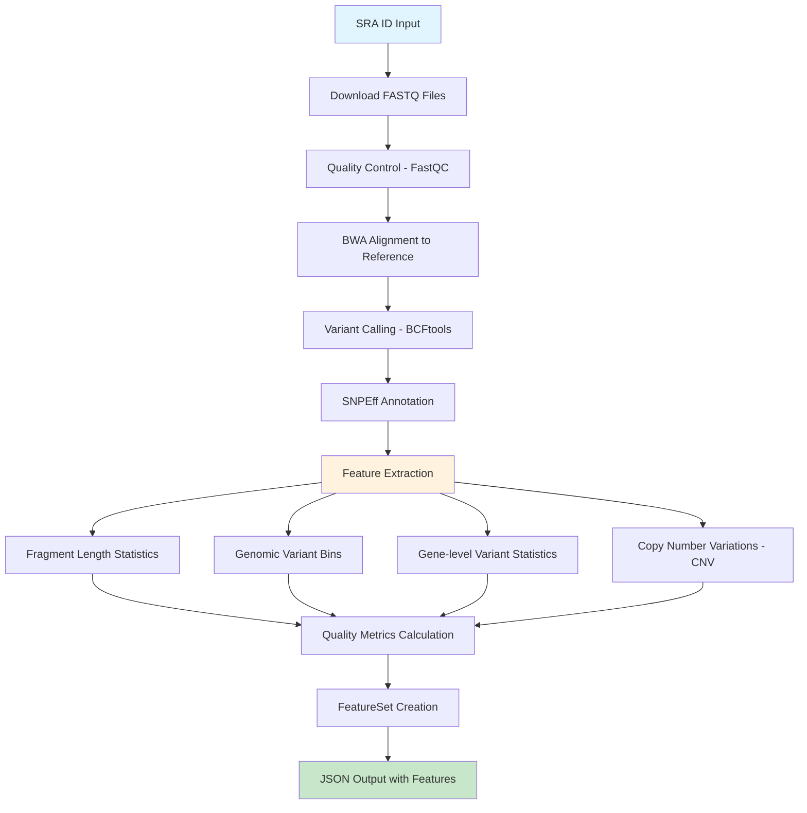
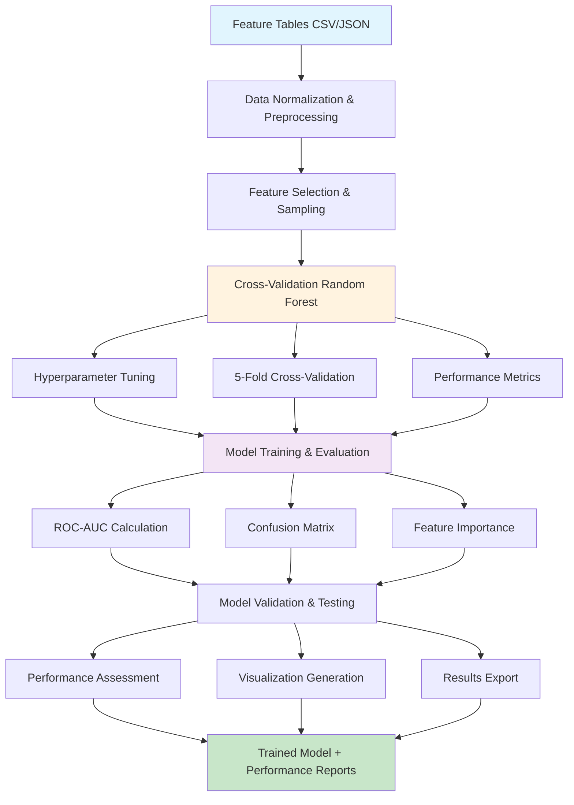

# SRA to Features Pipeline - Comprehensive Summary

## Overview

The **SRA to Features Pipeline** is a modern, production-ready bioinformatics pipeline designed to extract genomic features from SRA (Sequence Read Archive) data for LLM training. The pipeline processes raw sequencing data through multiple stages to generate structured, machine-learning-ready features.

## Pipeline Architecture

The pipeline consists of two main components:
1. **Feature Generation Pipeline** - Processes raw sequencing data to extract genomic features
2. **Machine Learning Pipeline** - Performs classification and validation on extracted features

### Overall Pipeline Architecture



---

## Feature Generation Pipeline

### Feature Generation Pipeline Flowchart



### Core Processing Steps

1. **Data Download** (`src/sra_pipeline/core/download.py`)
   - Retrieves FASTQ files from SRA using NCBI APIs
   - Handles retry logic and error recovery
   - Supports both single and paired-end data

2. **Quality Control** (`src/sra_pipeline/core/quality_control.py`)
   - **FastQC Analysis**: Comprehensive quality assessment
   - **BAM Statistics**: Mapping rates, coverage analysis
   - **Quality Metrics**: GC content, duplication rates, adapter content
   - **Quality Scoring**: Multi-dimensional quality assessment with warnings/errors

3. **Sequence Alignment** (`src/sra_pipeline/core/alignment.py`)
   - **BWA-MEM**: High-quality alignment to reference genome
   - **SAM to BAM**: Conversion and sorting
   - **Indexing**: BAM file indexing for downstream analysis

4. **Variant Calling** (`src/sra_pipeline/core/variant_calling.py`)
   - **BCFtools**: Variant detection and calling
   - **SNPEff**: Functional annotation of variants
   - **Quality Filtering**: Minimum quality and coverage thresholds

5. **Feature Extraction** (`src/sra_pipeline/core/feature_extraction.py`)
   - **Fragment Length Statistics**: For paired-end data analysis
   - **Genomic Bins**: Variant counts across genomic regions
   - **Gene Statistics**: Synonymous/nonsynonymous variant analysis
   - **CNV Detection**: Copy number variation identification using CNVpytor

### Output Features

The pipeline generates a structured `FeatureSet` containing:

- **FragmentLengthStats**: Mean, median, std, min, max, count
- **GenomicBin**: Chromosome, position, variant counts per bin
- **GeneVariantStats**: Gene-level variant analysis with dN/dS ratios
- **CNVRegion**: Copy number variations with confidence scores
- **QualityMetrics**: Comprehensive quality assessment

---

## Machine Learning Pipeline

### Machine Learning Pipeline Flowchart



### Data Processing (`src/sra_pipeline/utils/ml_features.py`)

1. **Feature Table Creation**
   - Aggregates features from multiple samples
   - Creates normalized feature matrices
   - Supports multiple output formats (CSV, TSV, Parquet, JSON)

2. **Data Preprocessing**
   - **Normalization**: Robust scaling and standardization
   - **Feature Selection**: Top N feature selection
   - **Sampling**: Balanced dataset sampling for training

### Model Training & Validation

1. **Cross-Validation Random Forest** (`cross_validate_rf`)
   - **Hyperparameter Tuning**: Grid search over multiple parameters
   - **5-Fold Cross-Validation**: Robust performance estimation
   - **Multi-class Support**: Handles multiple target classes
   - **Performance Metrics**: ROC-AUC, accuracy, precision, recall, F1

2. **Model Evaluation**
   - **Confusion Matrix**: Visual performance assessment
   - **Feature Importance**: Identifies most predictive features
   - **Performance Reports**: Comprehensive evaluation metrics

---

## Key Features

- **Type Safety**: Pydantic models for data validation (`src/sra_pipeline/models/features.py`)
- **Structured Logging**: Comprehensive logging with context
- **Error Handling**: Robust error recovery and reporting
- **Performance Monitoring**: Real-time metrics and resource tracking
- **Modular Design**: Clean separation of concerns
- **Quality Control**: Multi-level quality assessment throughout the pipeline

---

## Usage Examples

### Basic Pipeline Execution
```bash
# Single SRA ID
sra-pipeline run --sra-id SRR123456 --output-dir ./results

# Multiple SRA IDs
sra-pipeline run-batch --sra-ids SRR123456,SRR123457 --output-dir ./results

# From FASTQ files
sra-pipeline run --fastq sample1.fastq.gz sample2.fastq.gz --output-dir ./results
```

### Machine Learning Analysis
```bash
# Create feature table
sra-pipeline create-normalized-table --input-dir ./results --output-file features.csv

# Train classification model
sra-pipeline classify-features --input-file features.csv --output-folder ./ml_results

# Validate model
sra-pipeline run-model-validation-test --model-path ./ml_results/best_model.pickle --data-table-path features.csv --output-folder ./validation
```

---

## Technical Specifications

- **Language**: Python 3.8+
- **Dependencies**: BWA, SAMtools, BCFtools, FastQC, SNPEff, CNVpytor
- **Output Format**: JSON with structured feature data
- **Performance**: Optimized for large-scale genomic data processing
- **Scalability**: Supports batch processing of multiple samples
- **Extensibility**: Modular design allows easy addition of new features

---

## File Structure

```
src/sra_pipeline/
├── core/                    # Core pipeline functionality
│   ├── alignment.py         # BWA alignment
│   ├── download.py          # SRA data download
│   ├── feature_extraction.py # Feature extraction
│   ├── pipeline.py          # Main pipeline orchestration
│   ├── quality_control.py   # Quality assessment
│   └── variant_calling.py   # Variant detection
├── models/                  # Data models
│   └── features.py          # Pydantic feature models
├── utils/                   # Utility functions
│   ├── logging.py           # Logging utilities
│   └── ml_features.py       # ML pipeline functions
└── cli/                     # Command-line interface
    └── main.py              # CLI commands
```

---

## Quality Control & Validation

The pipeline includes comprehensive quality control at multiple levels:

- **Input Validation**: SRA data integrity checks
- **Processing Quality**: Alignment and variant calling quality
- **Output Validation**: Feature completeness and consistency
- **Performance Monitoring**: Resource usage and timing metrics

This pipeline represents a comprehensive solution for converting raw sequencing data into machine-learning-ready features, with robust quality control and validation throughout the process.
